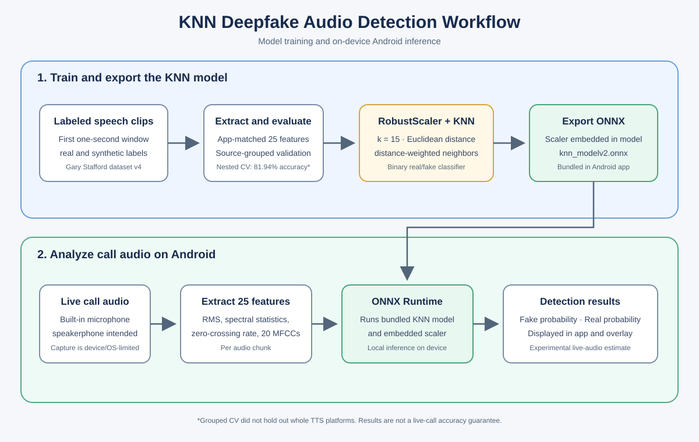

# RealTimeAudioDFDetect - Real-time Deepfake Audio Detection

A real-time Android deepfake-audio detection app that runs KNN and LightGBM classifiers locally with ONNX Runtime. It displays the models' separate fake/real scores and whether their predictions agree.



## Table of Contents
- [Overview](#overview)
- [Features](#features)
- [Key Technical Achievements](#key-technical-achievements)
- [Prerequisites](#prerequisites)
- [Installation](#installation)
- [Usage](#usage)
- [Core Components](#core-components)
- [Project Structure](#project-structure)
- [Development](#development)
- [License](#license)

## Overview

This project implements a complete pipeline for edge-deployed deepfake detection, from feature extraction to real-time inference.

**Feature Extraction Process:**
- 25 KNN features per live audio chunk: RMS, spectral centroid, bandwidth, rolloff, zero-crossing rate, and 20 MFCC means
- 26 LightGBM inputs: an Android-estimated chroma feature followed by the same 25 features
- Audio is processed at 16 kHz; call monitoring uses chunks from the built-in microphone and is intended for speakerphone use
- Live monitoring collects one-second chunks and makes a new prediction once per second
- Each model receives features in its respective training column order

**Model Deployment:**
- KNN ONNX input shape: `[batch, 25]`; RobustScaler is embedded in the graph
- LightGBM ONNX input shape: `[batch, 26]`; fake is class 0, while the KNN model's fake class is class 1
- Each ONNX model outputs class probabilities; their scores are shown separately
- ONNX Runtime uses available execution providers with fallback; CPU inference is supported
- Release builds include ONNX Runtime with QNN and try the Snapdragon GPU backend first, then QNN HTP, NNAPI, and CPU as available. Debug builds use the standard Android ONNX Runtime so they can run on x86_64 emulators. Android emulators do not emulate Snapdragon hardware; QNN GPU acceleration must be verified on a physical compatible Snapdragon device

**Edge Integration:**
- Android foreground service with automatic call detection
- Real-time visual overlay, separate fake/real scores, and model agreement status
- 100% local processing - no network connectivity required
- Privacy-first design with in-memory audio processing

## Features

- **Audio Features**: 25-dimensional KNN and 26-dimensional LightGBM feature vectors
- **Edge Deployment**: ONNX Runtime with CPU fallback
- **Real-Time Alerts**: Visual overlay with confidence-based threat detection
- **Auto-Activation**: Foreground service monitors calls automatically
- **Privacy-First**: 100% local processing, no data transmission
- **Models**: `app/src/main/assets/models/knn_modelv2.onnx` and `lgbmv2.onnx`

## Key Technical Achievements

**Model and evaluation:**
- Audio processing: 25 KNN and 26 LightGBM input features per chunk
- The bundled KNN is trained on one-second clips from Gary Stafford's CC BY 4.0 dataset, with RobustScaler embedded in the ONNX graph
- Nested, source-grouped five-fold evaluation on that dataset: 81.94% accuracy and 85.85% fake recall; this is not a live-call benchmark
- Evaluation groups keep clips from the same source recording/voice together, but do not hold out entire synthetic generator platforms
- The bundled `lgbmv2.onnx` was retrained using Android-matched features from 300 CC BY 4.0 clips: 100 Gary Stafford real, 100 Amazon Polly synthetic, and 100 ElevenLabs synthetic
- The training split keeps source recordings/voice IDs grouped: 239 clips for training and 61 source-grouped clips held out for evaluation. The selected LightGBM achieved 63.93% accuracy and 61.19% balanced accuracy on that holdout, compared with 22.95% and 23.16% for the previous model using the same feature port/split
- Held-out per-category accuracy was 11/21 (52.38%) Gary Stafford real, 13/14 (92.86%) Amazon Polly synthetic, and 15/26 (57.69%) ElevenLabs synthetic. This indicates limited generalization, particularly to unseen ElevenLabs voices and Gary recordings; it is not a production or live-call accuracy claim
- The holdout comparison is also used as a promotion gate, so it is not an untouched final test. After evaluation, the exported model is refit on all 300 clips; the 61-clip scores describe the pre-refit candidate, not an independent test of the final all-data artifact
- Training clips span 14 Gary Stafford recordings, 30 Polly voice IDs, and 28 ElevenLabs voice IDs. The samples are full 2.5–13 second dataset segments; the app feature extractor uses up to six seconds, not one-second windows
- One-second live predictions have not been validated on phone hardware; Android call capture and acoustics may reduce reliability
- One-second live predictions have not been validated on phone hardware; Android call capture and acoustics may reduce reliability

**Architecture Highlights:**
- KNN model input: `[batch, 25]`; fake class index 1
- KNN configuration: 15 neighbors, Euclidean distance, distance weighting
- LightGBM model input: `[batch, 26]`; fake class index 0
- Alert system: separate fake/real probability scores with experimental warnings

## Prerequisites

- Android device (API 24+)
- Android Studio for development
- Required call/audio permissions and microphone access
- Speakerphone is intended for call-audio capture; actual capture is device- and Android-version-dependent

## Installation

### Build and Install
```bash
./gradlew assembleDebug
adb install app/build/outputs/apk/debug/app-debug.apk
```

### Grant Permissions
Required permissions:
- Phone state access, Audio recording, System overlay
- Foreground service (microphone + phone call types)

## Usage

### Real-Time Detection
1. **Auto-Activation**: Service starts automatically during phone calls
2. **Visual Alerts**: Real-time overlay shows detection status:
   - 🔍 **Yellow**: Analyzing audio chunks
   - ✅ **Green**: Both models flag the chunk as real
   - ⚠️ **Yellow**: Models disagree or KNN confidence is below its alert threshold
   - ⚠️ **Red**: Both models flag fake (the overlay uses a 70% KNN threshold)
3. **Privacy**: All processing occurs locally, no data transmission

### Bundled Demo Audio
Use **Test real sample** or **Test fake sample** in the Tools section for the original examples, or choose **Browse 30 attributed dataset clips** to select among ten real clips from Gary Stafford's dataset, ten Amazon Polly fakes, and ten ElevenLabs fakes. All are run through both models. Reference labels come from the dataset; predictions may not match them, and this small selection is not an accuracy test. Clips are from [Gary Stafford's Deepfake Audio Detection Dataset v4](https://huggingface.co/datasets/garystafford/deepfake-audio-detection), revision `fcf5344bb7f82b54b6b932291326d29750ef1e82`, licensed under [CC BY 4.0](https://creativecommons.org/licenses/by/4.0/). The dataset contains 1,866 clips total: 933 real and 933 synthetic. Its synthetic audio is attributed to these text-to-speech platforms:

| Synthetic audio source | Clips |
|---|---:|
| Amazon Polly | 209 |
| ElevenLabs | 173 |
| Hexgrad Kokoro | 68 |
| Hume AI | 116 |
| Luvvoice | 156 |
| Speechify | 211 |
| **Total synthetic clips** | **933** |

The existing `demo_fake.wav` comes from `fake/el_0001_part_001.flac`; `demo_real.wav` comes from `real/yt_0000_part_001.flac`. The 30 additional clips are 16 kHz mono 16-bit PCM WAV conversions from the three categories listed above; all source FLAC paths are recorded in `app/src/main/assets/samples/audio/dataset/MANIFEST.csv`. The samples exercise the app's audio-loading and inference flow; they are not a validation set, and detector predictions may not match their reference labels. Clip-level attribution and conversion details are in `app/src/main/assets/samples/audio/ATTRIBUTION.txt`.

### Example Detection Flow
```kotlin
// The service extracts features for both models and reports separate scores.
val result = service.analyzeRawAudio(audioData, SAMPLE_RATE)
val fakeProbability = result.fakeConfidence
val lightgbmFakeProbability = result.lgbmFakeConfidence
```

## Core Components

### Audio Processing
- **AudioProcessor**: Shared KNN/LightGBM feature extraction, including an experimental chroma estimate
- **RealTimeAudioDetectionService**: ONNX Runtime inference, call-audio monitoring, and provider fallback
- **PhoneStateReceiver**: Automatic call detection and service activation

### User Interface
- **OverlayView**: Real-time visual alerts with confidence-based threat levels
- **MainActivity**: App configuration and monitoring controls

### Model Integration
- **ONNX Runtime**: Loads bundled `knn_modelv2.onnx` and `lgbmv2.onnx`
- **Feature Pipeline**: 16 kHz call audio → one-second chunks → 25/26 model-specific features → separate ONNX inference → fake/real probabilities

## Project Structure

```
DeepFakeDetector_edge/
├── app/src/main/
│   ├── java/com/example/realtimeaudiodetect/
│   │   ├── AudioProcessor.kt           # Audio feature extraction
│   │   ├── RealTimeAudioDetectionService.kt # Edge deployment service
│   │   ├── OverlayView.kt             # Real-time visual alerts
│   │   └── PhoneStateReceiver.kt      # Call detection
│   ├── assets/models/                 # KNN and LightGBM ONNX models
│   ├── assets/samples/audio/          # Attributed real/fake demo WAV files
│   └── AndroidManifest.xml           # Permissions and services
├── notebooks/                         # Training notebooks
└── README.md
```

## Development

### Model Requirements
- **KNN Model**: `app/src/main/assets/models/knn_modelv2.onnx`
- **KNN Input Shape**: `[batch, 25]`
- **KNN Input Features**: RMS, spectral centroid, bandwidth, rolloff, zero-crossing rate, followed by 20 MFCC means
- **LightGBM Model**: `app/src/main/assets/models/lgbmv2.onnx`, input shape `[batch, 26]`
- **LightGBM Input Features**: estimated chroma_stft followed by the 25 KNN features; this Android chroma is approximate
- **Audio Format**: 16 kHz mono or stereo PCM; live call inference uses one-second windows
- **Outputs**: Predicted class and class probabilities

### Retraining the KNN
The current model was retrained from the one-second feature pipeline in `notebooks/DeepFakeDetector/train_knn_1s.py`. Download the [Deepfake Audio Detection Dataset v4](https://huggingface.co/datasets/garystafford/deepfake-audio-detection) into a directory with `real/` and `fake/` FLAC subdirectories, then run:

```bash
python notebooks/DeepFakeDetector/train_knn_1s.py --dataset-root path/to/dataset
```

The script selects KNN settings with source-grouped cross-validation, fits the selected RobustScaler/KNN pipeline on all one-second clips, and exports the ONNX model to the app assets by default. The dataset is licensed under [CC BY 4.0](https://creativecommons.org/licenses/by/4.0/); attribution is recorded in `app/src/main/assets/samples/audio/ATTRIBUTION.txt`.

### Retraining the LightGBM
Install the dependencies from `requirements.txt`, then run:

```bash
python notebooks/DeepFakeDetector/train_lgbm_york.py
```

This tunes LightGBM with five-fold stratified cross-validation on the training portion of `audio_features_stringremoved.csv`, compares it to the bundled ONNX model on the fixed 30% random holdout, and replaces `lgbmv2.onnx` only if holdout accuracy improves. The source CSV lacks source IDs and audio-duration metadata, so its holdout score must not be interpreted as one-second or live-call accuracy.

The app includes 100 clips per source category (300 total). To refresh/recreate the attributed bundle from the pinned dataset revision, run:

```bash
python notebooks/DeepFakeDetector/prepare_bundled_audio_dataset.py
```

The script downloads from the pinned dataset revision, converts to mono 16 kHz PCM16 WAV, preserves existing samples, and records each original FLAC path in `dataset/MANIFEST.csv`.

To train and export the LightGBM model on the expanded sample set, run:

```bash
python notebooks/DeepFakeDetector/train_lgbm_bundled_audio.py
```

This ports the app's 26 input features, uses source-grouped cross-validation for parameter selection, and evaluates on a source-grouped holdout before refitting the final ONNX model on all 300 clips. The bundled files are 2.5–13 second segments, analyzed as full clips (up to six seconds), not one-second windows. The dataset is small and source-limited; holdout metrics are exploratory and should not be treated as real-world accuracy.

### Adding New Features
1. Keep feature extraction in `AudioProcessor.kt` aligned with each model’s training feature order and scaling.
2. Update model input/output handling in `RealTimeAudioDetectionService.kt` if the ONNX interface changes.
3. Update the displayed probabilities in `MainActivity.kt` and `OverlayView.kt` as needed.

### Key Dependencies
- ONNX Runtime Android
- Foreground service framework

## License

This project is licensed under the MIT License - see the LICENSE file for details.

---

All courses.

* [Part 1: Audio deepfake fraud detection system](https://thehyperplane.substack.com/p/audio-deepfake-fraud-detection-system?r=5l0jbv)  
* [Part 2: Training a model to detect deepfake audio](https://thehyperplane.substack.com/p/training-a-model-to-detect-deepfake?r=5l0jbv)
* [RealTimeAudioDetect on the Edge: Building Smarter Detection Where It Counts](https://thehyperplane.substack.com/p/training-a-model-to-detect-deepfake?r=5l0jbv)
* [Beyond the Cloud: Why the Future of AI Is on the Edge](https://thehyperplane.substack.com/p/beyond-the-cloud-why-the-future-of?r=5l0jbv)
